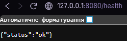
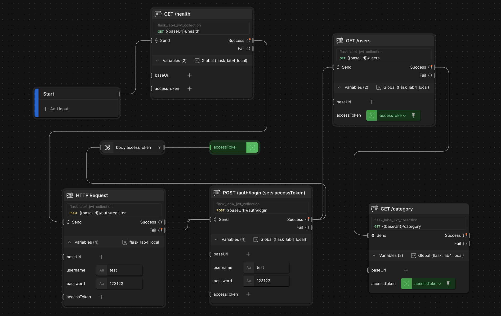

# Expenses API (Flask + PostgreSQL)

REST API для обліку витрат (**categories + records**) з базою даних PostgreSQL.  
Проєкт виконується у межах лабораторних робіт та поступово ускладнюється.

## Зміст
- [Швидкий старт (Docker)](#швидкий-старт-docker)
- [Міграції](#міграції)
- [Postman](#postman)
- [Лабораторна робота №3](#лабораторна-робота-3--flask--postgresql--orm)
- [Лабораторна робота №4](#лабораторна-робота-4--jwt-авторизація)

---

## Стек
- Flask
- Flask-SQLAlchemy
- Flask-Migrate (Alembic)
- PostgreSQL
- Marshmallow
- JWT (для ЛР4): `flask-jwt-extended`
- Hash паролів (для ЛР4): `passlib`

> Примітка про драйвер PostgreSQL:
> - для Python 3.11 зазвичай працює `psycopg2-binary`
> - для Python 3.13 краще використовувати `psycopg` (v3)

---

## Швидкий старт (Docker)

### 1) Підняти сервіси
```bash
docker compose up -d --build
```

### 2) Застосувати міграції (створити/оновити таблиці)
```bash
docker compose exec api sh -lc "export FLASK_APP=app.py && flask db upgrade"
```

### 3) Перевірка
- `http://localhost:8080/health` → `{ "status": "ok" }`

> Якщо база «обнуляється» після перезапусків — перевір, що в `docker-compose.yaml` є volume для Postgres (наприклад `pgdata:/var/lib/postgresql/data`).

---

## Міграції
- Генерація (коли змінюються моделі):
```bash
export FLASK_APP=app.py
flask db migrate -m "migration message"
```
- Застосування:
```bash
export FLASK_APP=app.py
flask db upgrade
```

На проді зазвичай виконується **лише** `flask db upgrade` після деплою нової версії коду.

---

## Postman
У папці `postman/` зберігаються:
- collections
- environments (local / production)

Типовий сценарій:
1) Import collection + environment
2) Обрати environment (наприклад `local`)
3) Виконувати запити по порядку (для ЛР4: спочатку login, щоб отримати token)

---

# Лабораторна робота №3 — Flask + PostgreSQL + ORM
## Тема: Валідація, обробка помилок та ORM у бекенд-застосунку

**Студент:** Пашко Максим, група ІО-32  
**Варіант:** №2 — *Користувацькі категорії витрат*  

Ця лабораторна робота **продовжує проєкт з Лабораторної роботи №2**.  
Зберігається структура ендпоінтів, але замість роботи “в пам’яті” тепер використовується:

- база даних **PostgreSQL** (у Docker-контейнері),
- **SQLAlchemy** як ORM,
- **Flask-Migrate** для міграцій,
- **Marshmallow** для валідації вхідних даних,
- єдина JSON-структура для помилок.

---

## Основний функціонал

### 1. Сутності

- **User**
  - `id: int`
  - `name: str` (унікальне ім’я)

- **Category**
  - `id: int`
  - `name: str`
  - `is_global: bool`
  - `user_id: int | null` — власник категорії або `null` для глобальних

- **Record**
  - `id: int`
  - `user_id: int`
  - `category_id: int`
  - `amount: float`
  - `created_at: datetime`

---

### 2. Логіка варіанту №2 — Користувацькі категорії витрат

- **Глобальні категорії**:
  - `is_global = true`
  - `user_id = null`
  - доступні всім користувачам

- **Користувацькі категорії**:
  - `is_global = false`
  - `user_id = <id користувача>`
  - бачить і може використовувати **тільки власник**

- При створенні запису витрати (`POST /record`):
  - якщо категорія **глобальна** → дозволено для будь-якого користувача
  - якщо категорія **користувацька** → дозволено **тільки користувачу-власнику**
  - інакше повертається помилка:
    ```json
    { "error": "forbidden_category" }
    ```

---

## Технології (ЛР3)
- Python 3.11
- Flask
- Flask-SQLAlchemy
- Flask-Migrate
- Marshmallow
- PostgreSQL (Docker)
- psycopg2-binary
- Postman (для тестування API)

---

## Скріншоти виконання роботи (ЛР3)




---

## Структура проєкту
```text
flask_lab3/
  app.py
  config.py
  docker-compose.yaml
  requirements.txt
  migrations/
  README.md
  postman/
    Lab2 Expenses API.postman_collection.json
    env_local.postman_environment.json
    ...
```

---

# Лабораторна робота 4 — JWT авторизація

## Ключові зміни (порівняно з ЛР3)
- Додано реєстрацію та логін користувача
- Паролі зберігаються у вигляді хешу
- Захищені маршрути потребують JWT (`Authorization: Bearer <token>`)
- Додано `/me`, `/users` та захист CRUD-операцій

## Маршрути ЛР4

### Public
- `GET /health`
- `GET /`
- `POST /auth/register`
- `POST /auth/login`

### Protected (Bearer Token)
- `GET /me`
- `GET /users`
- `GET /category`
- `POST /category`
- `DELETE /category/<id>`
- `DELETE /category?id=<id>` (alias)
- `GET /record`
- `GET /record?category_id=<id>`
- `POST /record`
- `GET /record/<id>`
- `DELETE /record/<id>`

