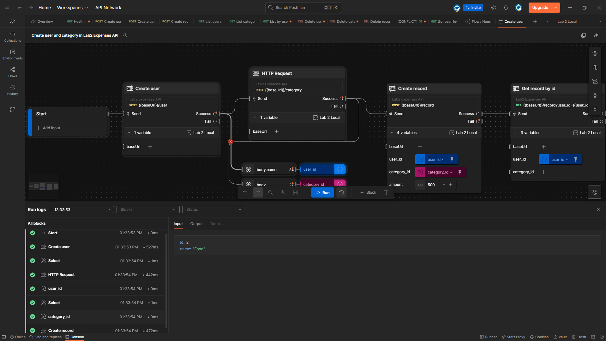

# Render.com
https://flask-lab2.onrender.com

# Lab 2 — Expenses REST API (Flask)

Базове REST API для обліку витрат з in-memory сховищем.

## Швидкий старт (локально)

```bash
python -m venv .venv
# Windows: .venv\Scripts\activate
# Linux/Mac: source .venv/bin/activate
pip install -r requirements.txt
python app.py
# сервер підніметься на http://127.0.0.1:8080
```

Або через Gunicorn:

```bash
gunicorn app:app
```

## Ендпоінти

### Users
- **POST /user** — створити користувача, тіло: `{ "name": "Max" }`
- **GET /user/<id>** — отримати користувача
- **DELETE /user/<id>** — видалити користувача (і пов'язані записи)
- **GET /users** — список користувачів

### Categories
- **GET /category** — список категорій
- **POST /category** — створити категорію, тіло: `{ "name": "Food" }`
- **DELETE /category?id=<id>** — видалити категорію (і пов'язані записи)

### Records
- **POST /record** — створити запис, тіло:
  ```json
  {
    "user_id": 1,
    "category_id": 1,
    "amount": 99.5,
    "created_at": "2025-10-13T10:00:00Z" // optional
  }
  ```
- **GET /record/<id>** — отримати запис
- **DELETE /record/<id>** — видалити запис
- **GET /record?user_id=...&category_id=...** — фільтрація. **Принаймні один** параметр обовʼязковий.

### Health
- **GET /health** — `{ "status": "ok" }`

## Postman
У теці `postman/` є:
- `Lab2 Expenses API.postman_collection.json` — колекція з усіма запитами
- `env_local.postman_environment.json` — середовище для локального запуску (`baseUrl` = `http://127.0.0.1:8080`)
- `env_production.postman_environment.json` — приклад прод-середовища (замінити `https://YOUR-RENDER-URL`)
- `flow.postman_flow.json` — мінімальний Postman Flow (можна імпортувати у Flows)

## Postman Flow


## Примітки
- Дані **не** зберігаються між рестартами — це свідомо (вимога лабораторної перед БД).
- Валідація мінімальна; розширена валідація буде у наступній лабораторній.
